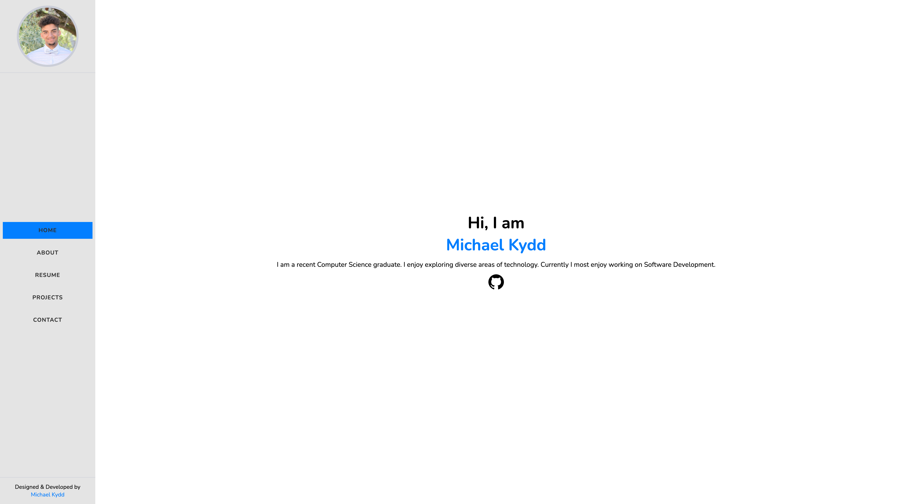
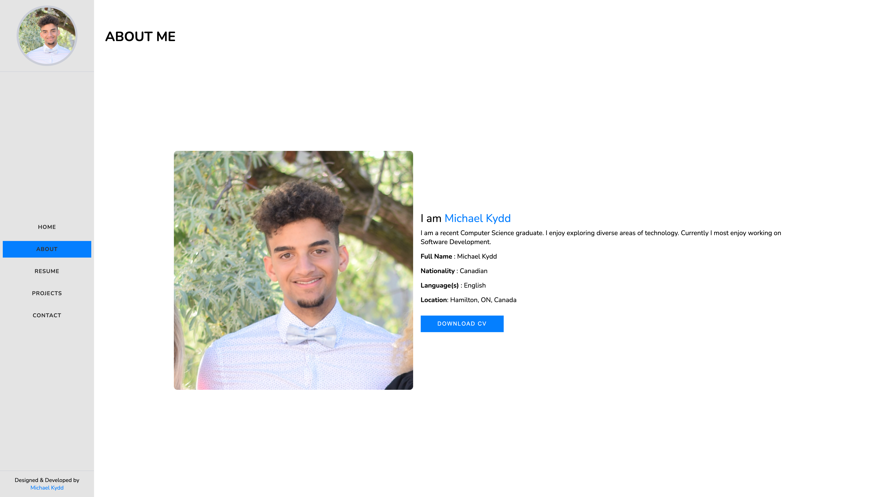
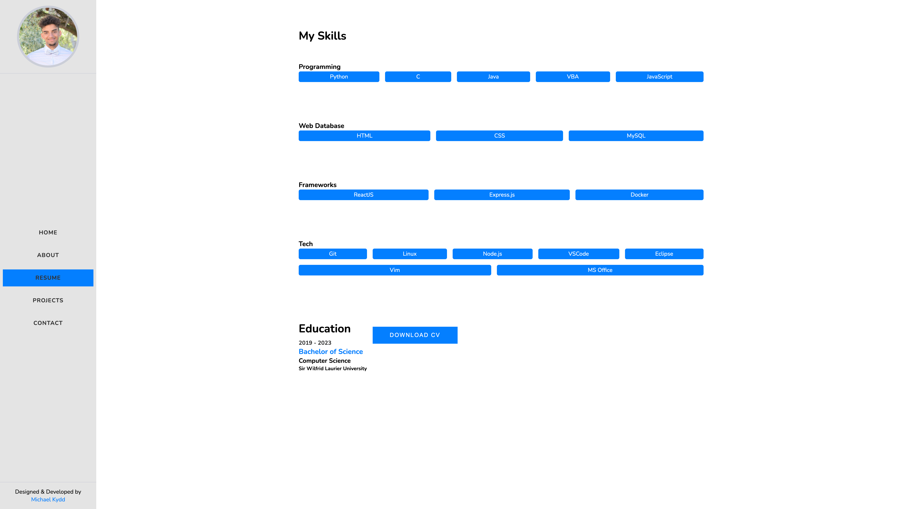
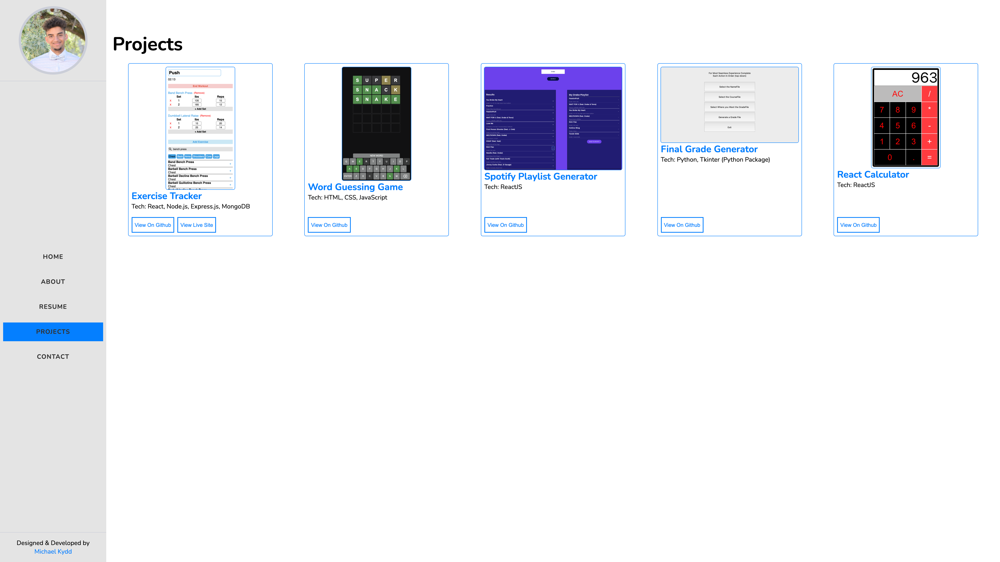
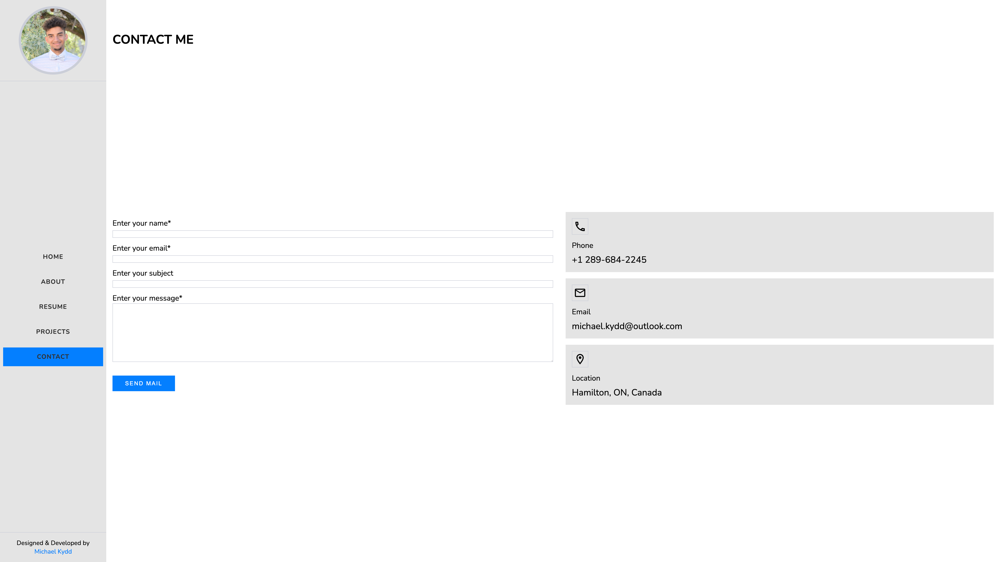

# React Portfolio

A personal portfolio website built using React. It showcases projects, skills, and provides contact information.

## Features

- **Responsive Design**: Optimized for both mobile and desktop devices.
- **Contact Form**: Allow visitors to get in touch.

## Screenshots

### Home Page

## About Section

### Skills Section

### Projects Section

### Contact Form

## Technologies Used

- Frontend: HTML, CSS, JavaScript, React